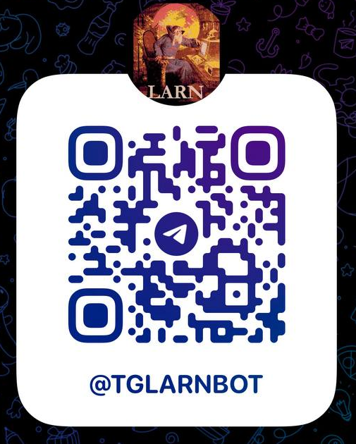
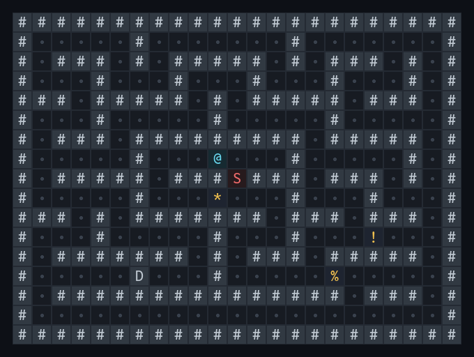
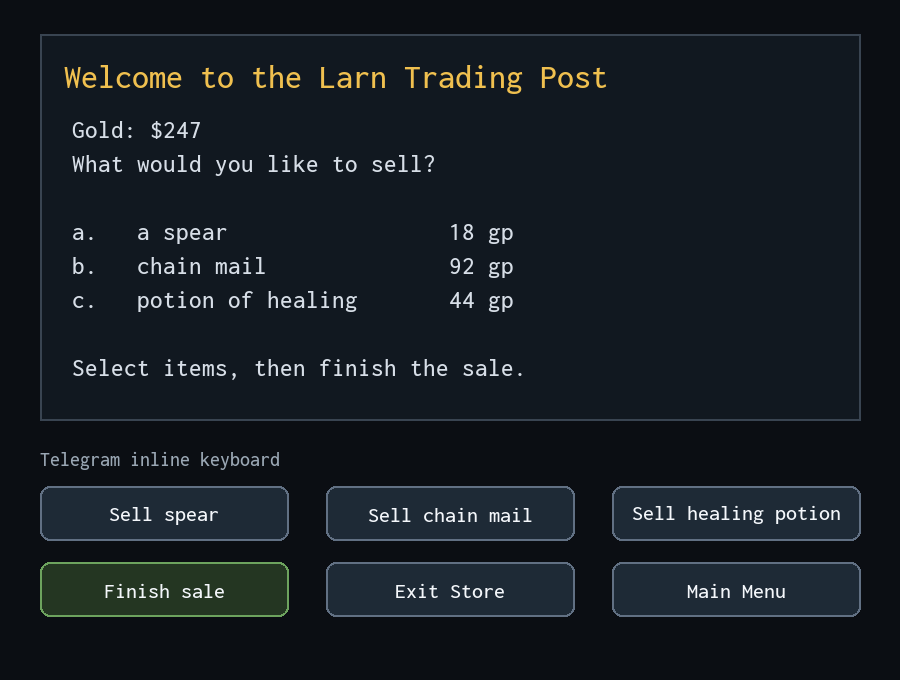
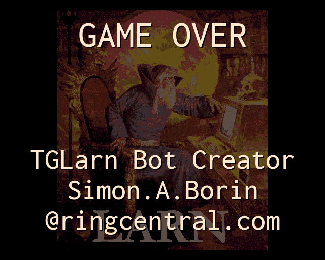

# TGLarn

**A classic roguelike, reimagined for Telegram.**

TGLarn brings the original ReLarn/Larn experience into a Telegram chat. The
game's C engine still controls the dungeon, combat, inventory, spells, shops,
character progression, and win or loss conditions. TGLarn replaces the terminal
interface with rendered maps, readable game messages, and contextual Telegram
buttons.

## Play

Open the live bot: [@tglarnbot](https://t.me/tglarnbot)

Visit the project site: [simonborin.github.io/tglarn](https://simonborin.github.io/tglarn/)

Scan the QR code or follow the link above to start a game:

## The Game

Larn is a classic turn-based roguelike about a parent searching for a cure for
a daughter who has contracted Dianthroritis. Explore the caverns of Larn, fight
monsters, collect treasure, learn spells, manage limited resources, and use the
services in town while searching for the Potion of Cure Dianthroritis.

Every action matters: the adventure ends when the hero succeeds, runs out of
time, or dies in the dungeon.

## Telegram Experience

- A complete ReLarn game session for every player.
- Dungeon maps rendered as images directly in the chat.
- Contextual inline controls for movement, combat, inventory, shops, prompts,
  and other game actions.
- Persistent progress that lets players return to an active run.
- Multiple map views adapted to different screen sizes.
- The original rules and mechanics preserved behind a mobile-friendly
  interface.

## Screenshots

### Exploring the dungeon

### Shopping with contextual controls

### End of a run

## How It Works

TGLarn runs the original ReLarn C engine as an isolated game process and
translates its terminal interface into Telegram-native interactions. A Python
adapter manages the process lifecycle and terminal protocol, while the bot
layer handles chat UX, image rendering, and persistent player sessions.

The original engine and the Telegram integration remain deliberately separate:

- `vendor/relarn/` — the upstream ReLarn source code and assets.
- `game/tglarn_game/` — the game adapter and ReLarn process bridge.
- `bot/tglarn_bot/` — Telegram handlers, controls, rendering, and persistence.
- `tests/` — automated coverage of gameplay integration and bot behavior.

## Created By

TGLarn was created by [@blooomberg](https://t.me/blooomberg)
([mrblooomberg@gmail.com](mailto:mrblooomberg@gmail.com)) together with Codex.

## Licensing & Credits

TGLarn is distributed under the GNU General Public License Version 2 terms
applicable to the ReLarn-derived work. The root GPL license text is stored in
`LICENSE.txt`; the upstream ReLarn copy is preserved in
`vendor/relarn/LICENSE.txt`.

- **Core engine:** ReLarn, Copyright (C) 1986-2020 by The Authors. The imported
  engine is located in `vendor/relarn/` and is distributed under the GNU General
  Public License Version 2, or at the user's option any later version, as stated
  in `vendor/relarn/Copyright.txt`.
- **Field of View library:** `libfov`, located in `vendor/relarn/src/fov/`,
  Copyright (c) 2006 Greg McIntyre. It is distributed under the MIT License; the
  preserved text is available in `LICENSES/libfov-MIT.txt` and
  `vendor/relarn/src/fov/COPYING-libfov`.
- **Font asset:** `Inconsolata-Medium.ttf`, located in
  `vendor/relarn/data/fonts/`, Copyright 2006 The Inconsolata Project Authors.
  It is licensed under the SIL Open Font License 1.1; the preserved text is
  available in `LICENSES/inconsolata-OFL-1.1.txt` and
  `vendor/relarn/data/fonts/OFL.txt`.
- **TGLarn integration:** the Telegram interface, game adapter, rendering,
  persistence, deployment support, documentation, and tests outside
  `vendor/relarn/`.

Pop-culture references and artifacts appearing in the upstream game belong to
their respective rights holders. Their presence in ReLarn or TGLarn does not
imply endorsement, sponsorship, or affiliation.
